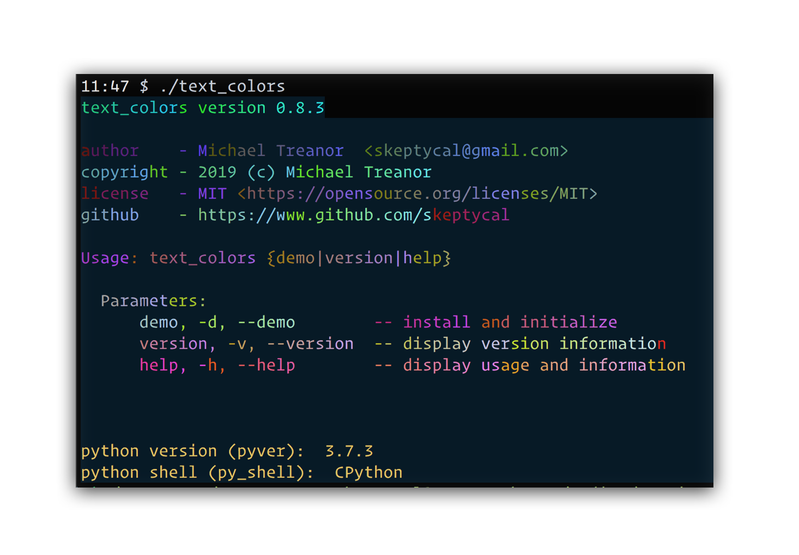
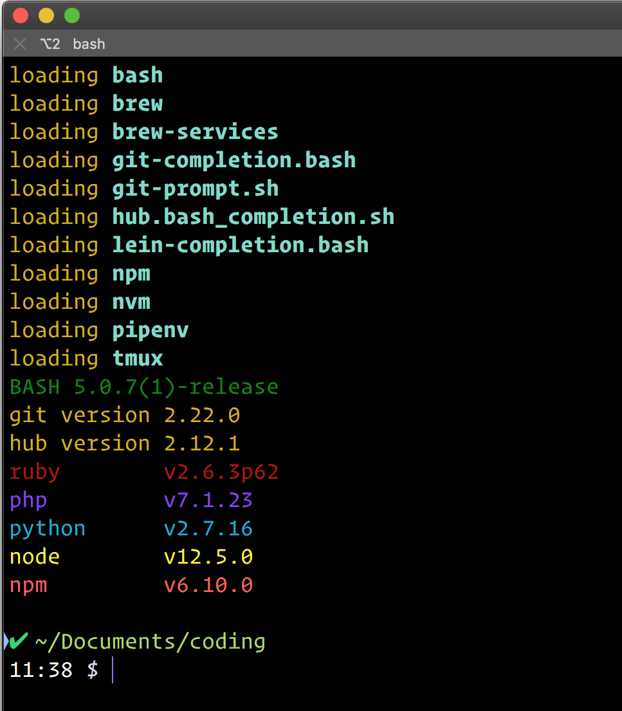
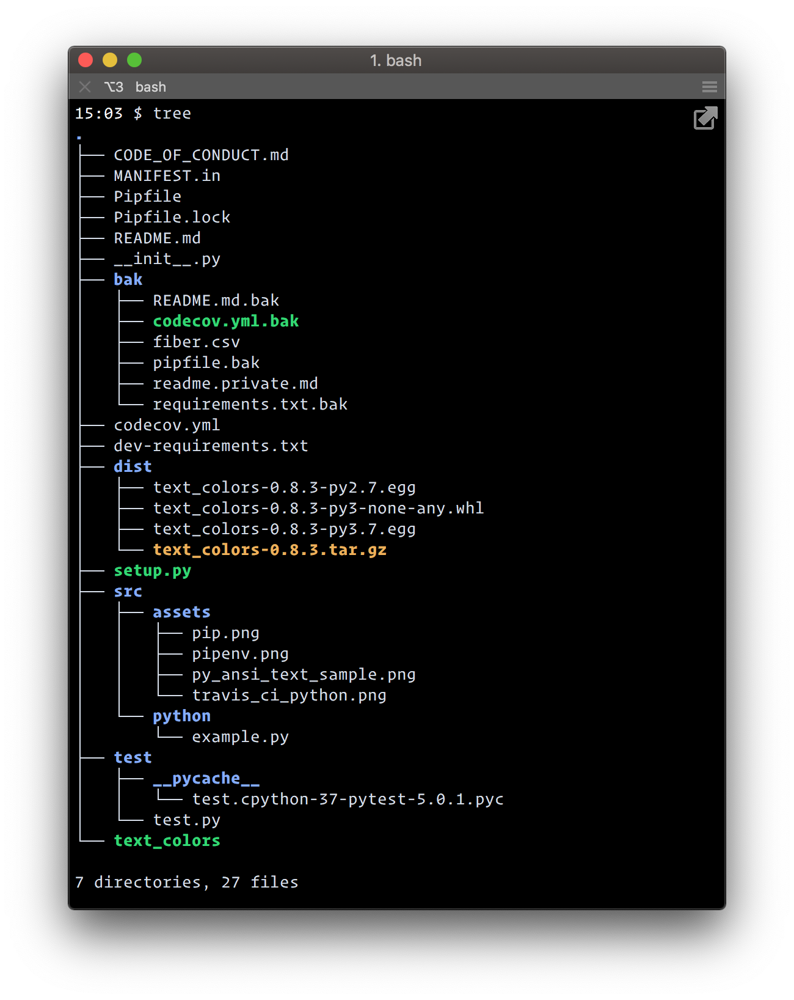

# text_colors version 0.8.3

 

 

 

 

Last update: 05-21-2019 | 23:24:03

---

### The obligatory Python module to add CLI ANSI color and other escape code formatting features.

> It seems like everyone who is working with the command line eventually finds a way to control the ansi colors and create their own prompt, so why not...

> I stand on the shoulders of giants!

**_Behold, the power of ANSI colors!_**

- can be used directly in python

---

## Installation

pip install text_colors

---

- can be called from bash scripts

---

Directory Tree

[netlify_link]:
[travis_link]:
[azure]: (https://img.shields.io/azure-devops/build/skeptycal0275/skeptycal/1.svg?color=blue&label=Azure%20DevOps&style=popout)
[pyver]: (https://img.shields.io/pypi/pyversions/flask.svg?color=Yellow&label=Python&style=popout)
